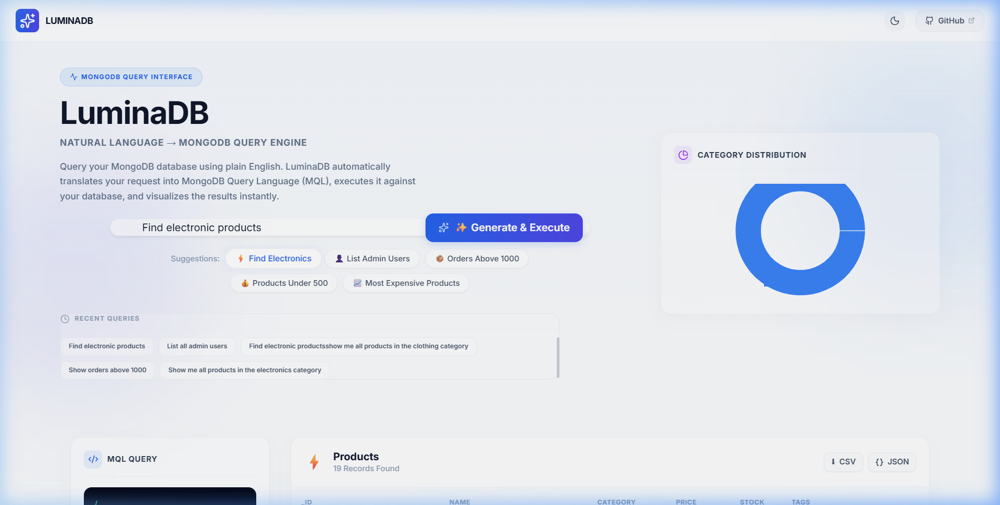
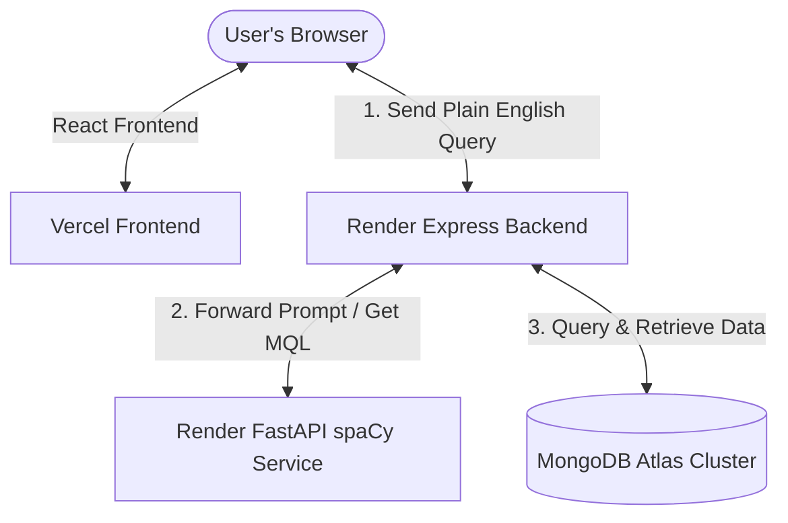
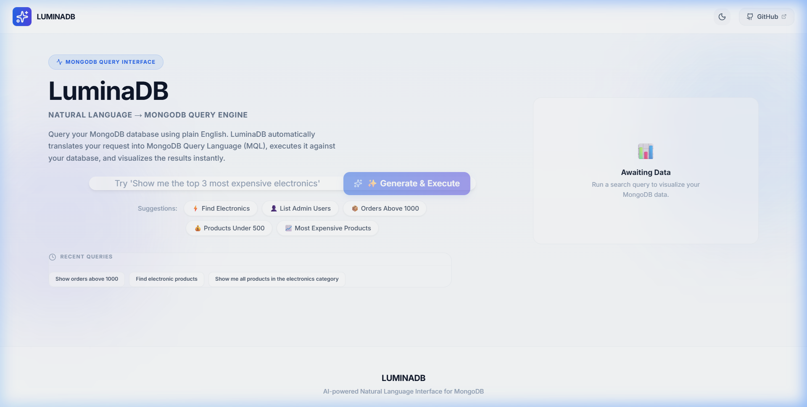
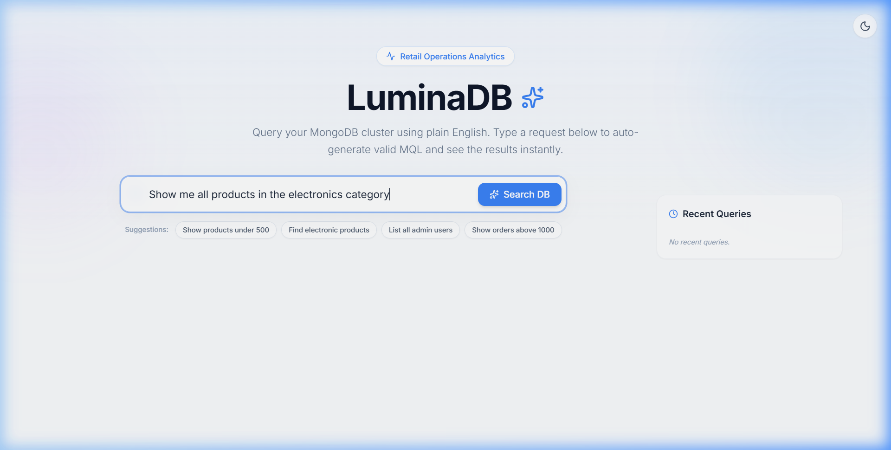
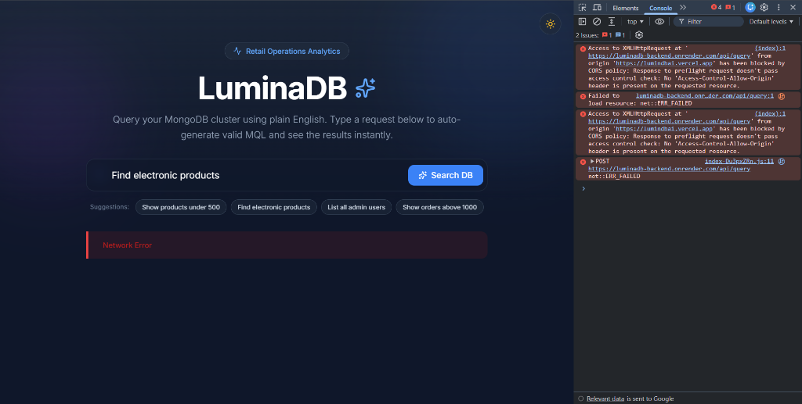
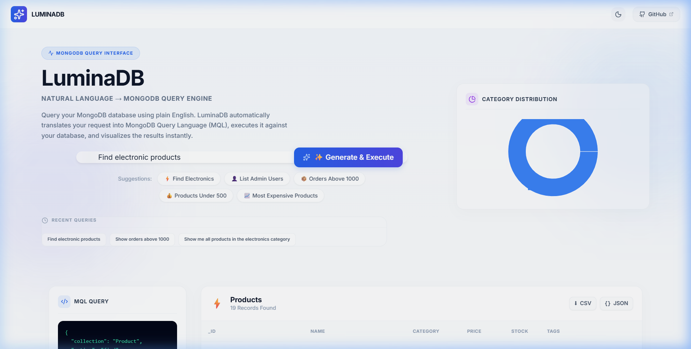
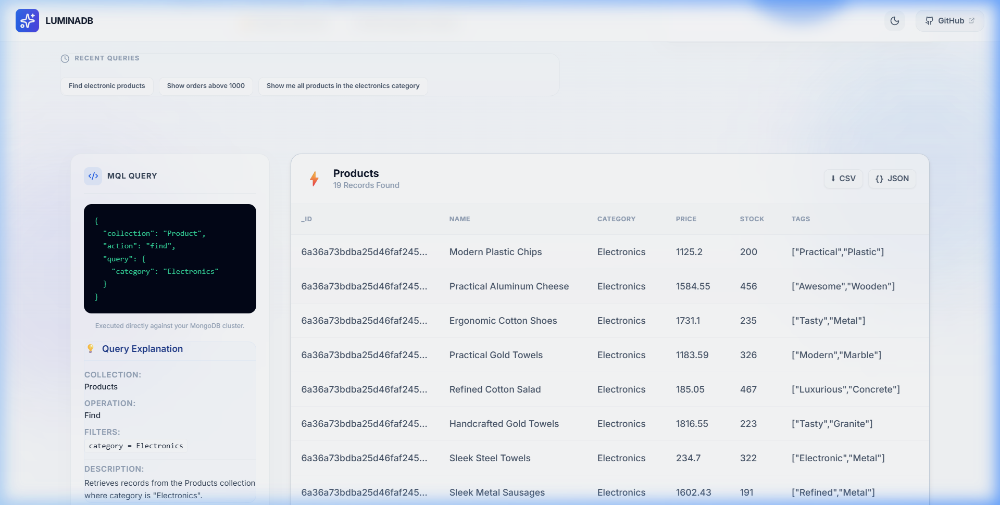

# LuminaDB

LuminaDB is a modern, end-to-end full-stack web application that translates natural language (plain English) into MongoDB Query Language (MQL), executes queries against a live MongoDB Atlas cluster, and visualizes the results instantly using responsive charts and tabular data.



## Features

- **Natural Language → MQL Engine**: Formulates database-ready MongoDB query documents locally and offline from English questions.
- **AI-Powered Loading & Progress Log**: Step-by-step query parser animations: `Understanding request...` ➔ `Generating MQL...` ➔ `Executing Query...` ➔ `Rendering Results`.
- **ChatGPT-Style Typewriter Code Sandbox**: Custom code blocks that animate MQL syntax on the fly.
- **Rich Analytics & Data Visualizations**: Automatic Recharts distribution graphs (Pie, Bar) with calculated dynamic percentage side-lists.
- **Wake Status & Wakeup Engine**: Live navbar status pills displaying ping responses of backend and NLP services, with a manual "Wake Services" action for Render's free tier.
- **Data Export Utilities**: Download filtered results immediately as JSON or CSV.
- **Glassmorphic Responsive Dark UI**: Premium SaaS-style interface designed using clean CSS.

## Architecture

LuminaDB utilizes a decoupled, high-performance microservices architecture to securely map queries and isolate concerns:



### API Query Execution Flow

1. **Query Dispatch**: The React frontend sends a POST request with the user's plain English query to `/api/query` on the **Express Backend**.
2. **NLP Translation**: Express forwards the prompt to `/translate` on the **FastAPI Python microservice**.
3. **Local NLP Parsing**: FastAPI loads the local spaCy model (`en_core_web_sm`), runs token parsing to extract database collection names, limits, sorts, and query fields, and returns a translated JSON MQL blueprint.
4. **Mongoose Execution**: Express maps the collection name to a Mongoose schema (`User`, `Product`, or `Order`) and queries the **MongoDB Atlas cluster**.
5. **Hydration & Visualizing**: Express returns the retrieved rows and the MQL query to the browser, which feeds it to Recharts for visual rendering.

## Screenshots

### Dashboard
The onboarding dashboard provides quick prompt suggestion chips to help get started instantly.


### Query Execution
Watch the AI analyze and run queries in real-time.


### Analytics
Category counts, distributions, and metrics rendered automatically.


### MongoDB Query Preview
The generated MQL code typed out inside a premium dark sandbox.


### Results Table
Interactive responsive table with custom scrolling, export functions, and full column alignment.


## Tech Stack

- **Frontend**:   
- **Backend Orchestrator**:   
- **NLP Translation Engine**:  
- **Database**: 
- **Hosting & Infrastructure**:  

## Installation

### Local Prerequisites
- Node.js (v18+)
- Python (v3.9+)
- MongoDB connection URI (Atlas or Local)

### 1. NLP Translation Service
```bash
cd LuminaDB/nlp-service
python -m venv venv
# Windows:
.\venv\Scripts\activate
# Linux/macOS:
source venv/bin/activate

pip install -r requirements.txt
python -m spacy download en_core_web_sm
python -m uvicorn main:app --reload --port 8000
```

### 2. Express Backend
Create a `.env` file under `LuminaDB/backend`:
```env
PORT=5000
MONGODB_URI=your_mongodb_connection_uri
NLP_SERVICE_URL=http://localhost:8000/translate
FRONTEND_URL=http://localhost:5173
```
Then start the server:
```bash
cd LuminaDB/backend
npm install
node seed.js # (Optional: seeds mock collection data)
npm start
```

### 3. Frontend Client
Create a `.env` file under `LuminaDB/frontend`:
```env
VITE_API_URL=http://localhost:5000
```
Then start the app:
```bash
cd LuminaDB/frontend
npm install
npm run dev
```

## Live Demo

- 🌐 **Live Website**: [https://lumindbai.vercel.app](https://lumindbai.vercel.app)
- ⚙️ **Backend Service (Health)**: [https://luminadb-backend.onrender.com/health](https://luminadb-backend.onrender.com/health)
- 🧠 **NLP Service (Health)**: [https://luminadb-nlp.onrender.com/health](https://luminadb-nlp.onrender.com/health)
- 📦 **GitHub Repository**: [https://github.com/SyedUzaiir/luminai](https://github.com/SyedUzaiir/luminai)

## Future Improvements

1. **Semantic RAG Embeddings**: Utilize vector search indices inside MongoDB Atlas to match complex customer intents that SpaCy token-parsing alone misses.
2. **Schema Auto-Discovery**: Remove custom model bindings by querying standard collections and building mapping rules in real-time.
3. **Database Write and Mutate Operations**: Provide strict sandbox permissions to translate modification sentences like *"Update user John's address to NYC"*.
